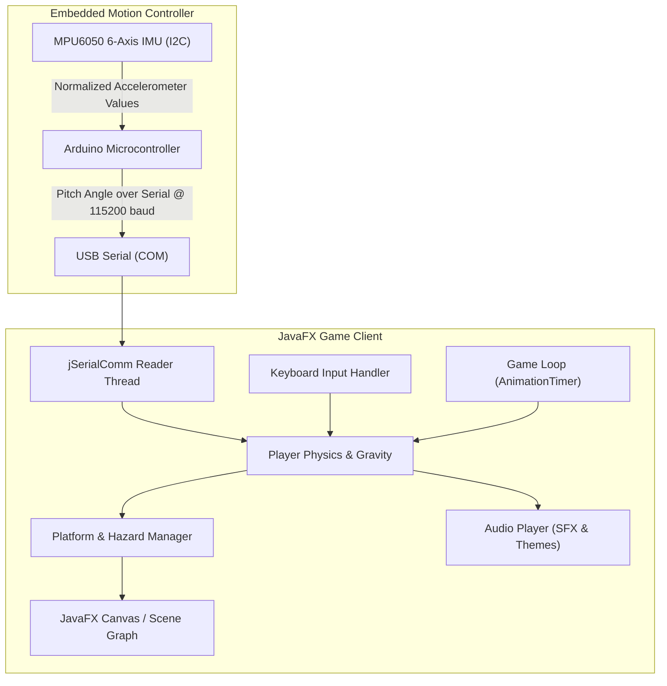

# DoodleJump PC Edition (JavaFX & Arduino IMU Hardware Controller)

A feature-complete recreation of the classic **DoodleJump** arcade game engineered in Java using JavaFX. The project integrates an embedded hardware controller featuring an **Arduino Uno** and **MPU6050 6-Axis IMU**, enabling players to steer the character naturally by physically tilting a handheld sensor unit over high-speed serial communication (`jSerialComm`), alongside standard keyboard input.

---

## Features

- **Dynamic Physics & Game Engine**:
  - Continuous vertical propulsion and gravity mechanics powered by JavaFX `AnimationTimer`.
  - Multiple platform archetypes: Static, horizontally oscillating, and breakable platforms.
  - Hazard encounters with enemy monsters (`Monster.java`) and projectile firing mechanics (`Projectile.java`).
  - Score tracking with dynamic height tracking and persistent high-score records (`ScoresPage.java`).
- **Physical Tilt Controller (Arduino + MPU6050)**:
  - Real-time accelerometer pitch estimation ($-\text{atan2}(a_x, \sqrt{a_y^2 + a_z^2})$).
  - Serial streaming at `115200 baud` using the `jSerialComm` Java library.
  - Seamless fallback to conventional keyboard controls (Left/Right arrows).
- **Multiple Themed Visual Environments**:
  - Classic Doodle Theme
  - Zombie Theme
  - Snow / Winter Theme
- **Sound & Audio Effects (`Audio.java`)**:
  - Integrated sound cues for jump springs, projectile shooting, monster collisions, and game over triggers.
- **Configurable Settings & Difficulty Levels**:
  - Adjustable difficulty presets (`DifficultyPage.java`), audio toggles, and calibration controls.

---

## System Architecture



---

## Project Structure

```text
DoodleJump_Game/
├── Arduino/
│   ├── Gyro.txt                      # Arduino C++ sketch for MPU6050 pitch calculation
│   ├── Arduino-MPU6050-master.zip    # MPU6050 library archive
│   └── jSerialComm.jar               # Serial communication library for Java
├── Docs/
│   ├── Technical Documentation.pdf   # In-depth architectural and mechanical specification
│   ├── User Manual.pdf              # Gameplay guide and hardware setup instructions
│   ├── First.png                     # Main Menu screenshot
│   ├── Second.png                    # Settings Menu screenshot
│   ├── Third.png                     # Credits Menu screenshot
│   ├── Fourth.png                    # Classic Doodle Theme gameplay screenshot
│   ├── Fifth.png                     # Zombie Theme gameplay screenshot
│   └── Sixth.png                     # Snow Theme gameplay screenshot
├── DoodleJump/
│   ├── GameLogic/
│   │   ├── Animation.java            # Sprite animation utilities
│   │   ├── GamePage.java             # Core game state and collision resolution
│   │   ├── Monster.java              # Monster AI and position updates
│   │   ├── PausePage.java            # In-game pause menu
│   │   └── Projectile.java           # Bullet mechanics and trajectory calculations
│   ├── Pages/
│   │   ├── Audio.java                # Audio clip player and sound management
│   │   ├── DifficultyPage.java       # Difficulty selection UI
│   │   ├── GameOverPage.java         # Game-over screen and retry logic
│   │   ├── Images.java               # Theme sprite loaders and asset managers
│   │   ├── MainPage.java             # Main menu interface
│   │   ├── ScoresPage.java           # Leaderboards and score view
│   │   └── SettingsPage.java         # Controller selection and audio preferences
│   ├── Main.java                     # Application bootstrap
│   ├── App.java                      # JavaFX Application launch orchestrator
│   └── Obstacle.java                 # Obstacle definitions and boundaries
└── README.md
```

---

## Hardware Controller Setup

### Bill of Materials
- 1x Arduino Uno (or Nano / Mega)
- 1x MPU6050 6-Axis Accelerometer & Gyroscope Module
- Jumper Wires & Breadboard / Enclosure

### Wiring Diagram

| MPU6050 Pin | Arduino Pin | Description |
|---|---|---|
| `VCC` | `5V` (or `3.3V`) | Power supply |
| `GND` | `GND` | Ground |
| `SDA` | `A4` (or dedicated SDA) | I2C Serial Data |
| `SCL` | `A5` (or dedicated SCL) | I2C Serial Clock |

### Firmware Upload
1. Open [`Arduino/Gyro.txt`](file:///e:/Ghanem-GitHub-Portfolio/DoodleJump_Game/Arduino/Gyro.txt) in the Arduino IDE (rename extension to `.ino` if desired).
2. Install the `MPU6050` library included in `Arduino/Arduino-MPU6050-master.zip`.
3. Select your Arduino board and COM port.
4. Upload the sketch. The microcontroller will stream pitch angles over serial at `115200 baud`.

---

## Installation & Running the Game

### Prerequisites
- [Java SE Development Kit (JDK)](https://www.oracle.com/java/technologies/downloads/) (version 11 or higher)
- [JavaFX SDK](https://openjfx.io/) (version 17 or compatible)

### Running from Command Line

1. Compile the source code including JavaFX modules and `jSerialComm.jar`:
   ```bash
   javac --module-path /path/to/javafx/lib --add-modules javafx.controls,javafx.fxml,javafx.media \
         -cp "Arduino/jSerialComm.jar" DoodleJump/*.java DoodleJump/*/*.java -d bin
   ```

2. Run the game:
   ```bash
   java --module-path /path/to/javafx/lib --add-modules javafx.controls,javafx.fxml,javafx.media \
        -cp "bin;Arduino/jSerialComm.jar" DoodleJump.Main
   ```

---

## Visual Gallery

| Main Menu | Settings Menu |
|---|---|
|  |  |

| Classic Doodle Theme | Zombie Theme |
|---|---|
|  |  |

| Snow Theme | Credits Menu |
|---|---|
|  |  |

---

## Documentation

For full implementation and operation details, refer to:
- [Technical Documentation](Docs/Technical%20Documentation.pdf)
- [User Manual](Docs/User%20Manual.pdf)

---

## Author

- **Mohamed Ghanem** - [Eng-Ghanem](https://github.com/Eng-Ghanem)
